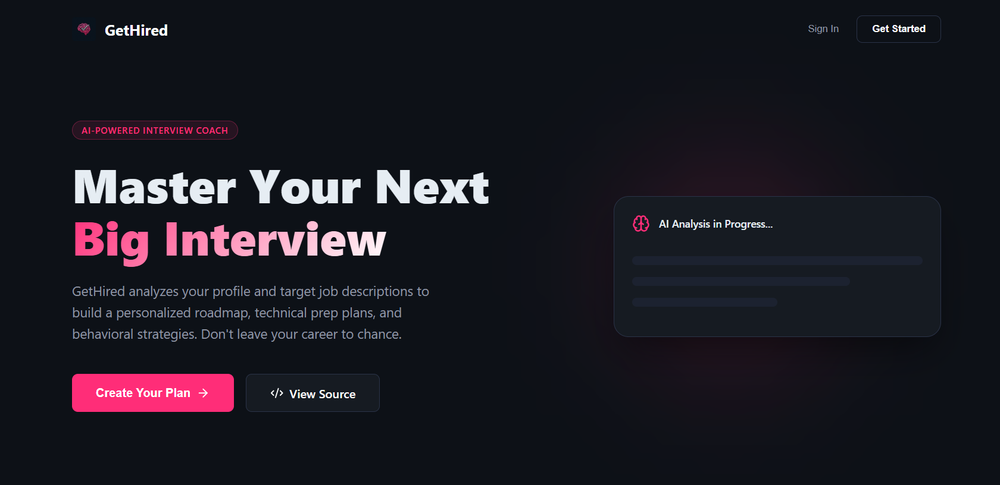
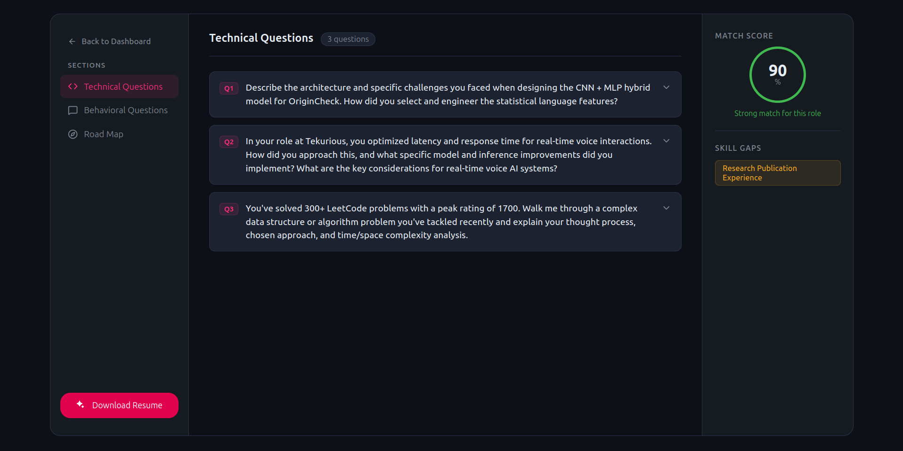
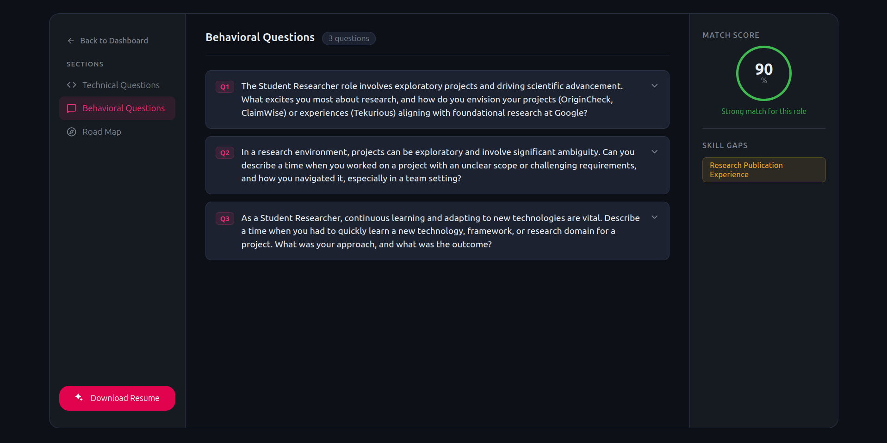
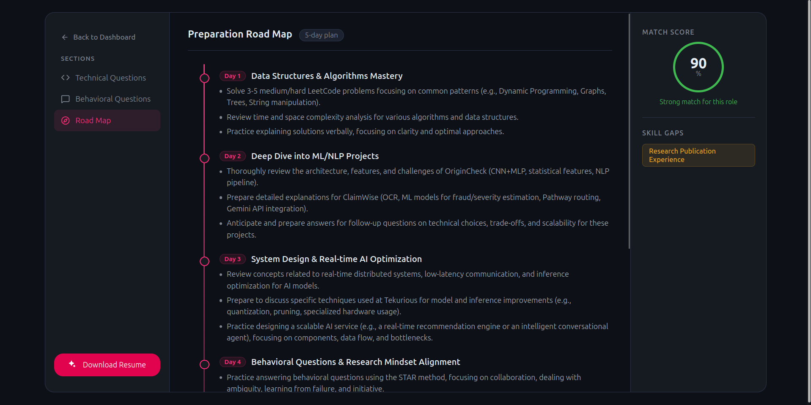

# GetHired (Interview AI Coach) 🚀

GetHired is a next-generation, AI-driven interview preparation platform that helps job seekers master their next big career opportunity. Using Google's **Gemini AI**, it analyzes target job descriptions against your unique profile to generate high-quality interview reports, personalized roadmaps, and custom resumes.






## ✨ Features

- 🧠 **AI-Powered Interview Strategy**: Generates detailed technical and behavioral questions tailored to specific job roles.
- 🗺️ **Personalized Roadmaps**: Get a day-by-day preparation schedule to bridge your skill gaps.
- 🔍 **Skill Gap Analysis**: identifies critical missing skills from your profile based on the job requirements.
- 📄 **Smart Resume Generator**: Automatically generates a professional, ATS-friendly resume tailored to the job description and exports it as a PDF.
- 🔓 **Secure Authentication**: Built-in user management with JWT-based protection.
- 🎨 **Premium UI/UX**: Dark-themed, minimalist interface designed for focus and clarity.

## 🛠️ Tech Stack

**Frontend:**
- React (Vite)
- React Router 7
- SCSS (Premium Theme)
- Lucide React (Icons)
- React Hot Toast

**Backend:**
- Node.js & Express
- MongoDB (Mongoose)
- Google GenAI SDK (Gemini AI)
- Puppeteer (PDF Generation)
- Multer (File Uploads)

---

## 🚀 Getting Started

### Prerequisites
- Node.js (v18+)
- MongoDB Atlas account (or local MongoDB)
- Google Gemini API Key

### 1. Installation
Clone the repository and install dependencies for both Frontend and Backend:

```bash
# Clone
git clone https://github.com/kanak227/interview-ai-yt.git

# Install Backend
cd Backend
npm install

# Install Frontend
cd ../Frontend
npm install
```

### 2. Environment Variables
Create a `.env` file in the `Backend` directory:

```env
PORT=3000
MONGO_URI=your_mongodb_connection_string
JWT_SECRET=your_jwt_secret
GOOGLE_GENAI_API_KEY=your_gemini_api_key
```

### 3. Running the App

**Start Backend Server:**
```bash
cd Backend
npm run dev
```

**Start Frontend Development Server:**
```bash
cd Frontend
npm run dev
```

Visit `http://localhost:5173` to see the application.

---

## 📸 Project Flow
1. **Landing Page**: Get introduced to the GetHired ecosystem.
2. **Dashboard**: Upload your PDF resume or provide a self-description alongside the target job description.
3. **AI Report**: View your personalized interview questions, match score, and roadmap.
4. **Resume Creation**: Download a professional resume specifically optimized for the role.

---

## 🤝 Contributing
Contributions are always welcome! Feel free to open issues or pull requests.


